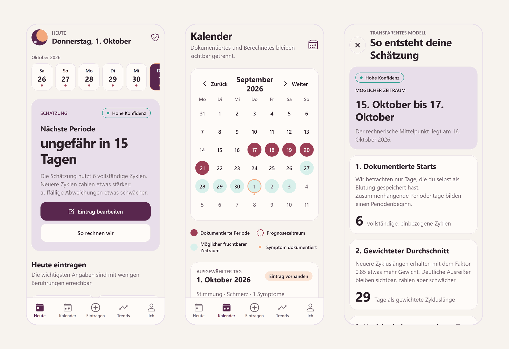
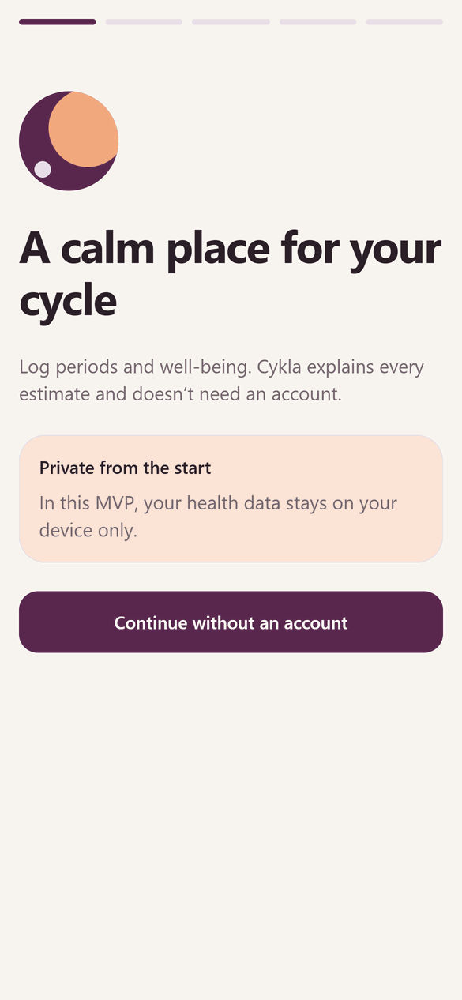
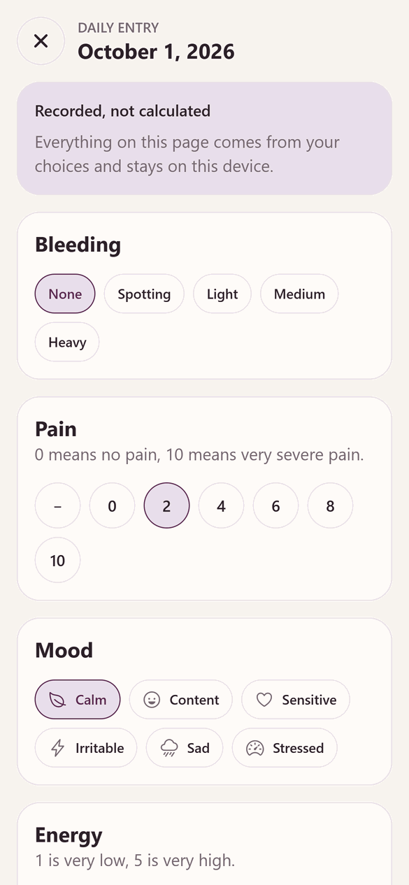
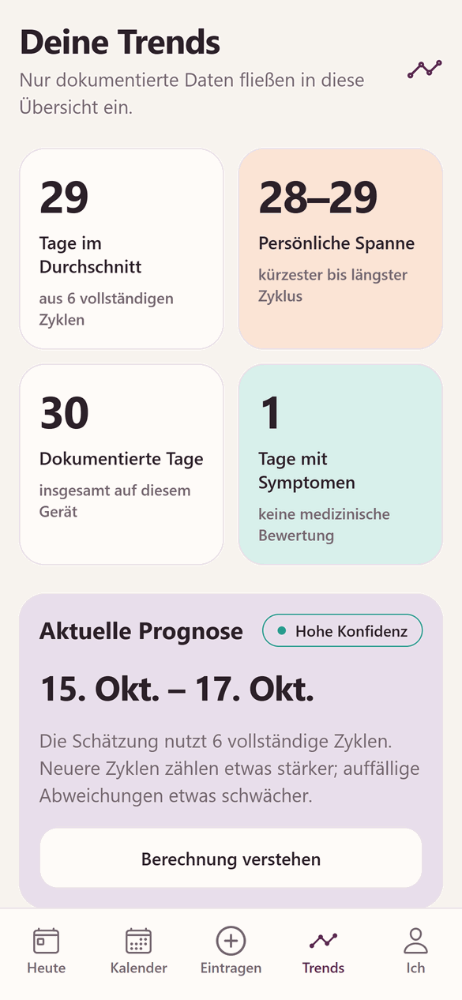
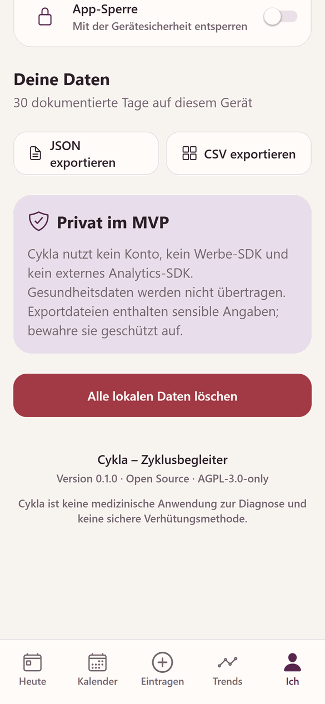

<p align="center">
  
</p>

<h1 align="center">Cykla</h1>

<p align="center">
  An offline-first cycle and period tracker that keeps what you record apart from what it estimates.
</p>

<p align="center">
  <a href="#features">Features</a>&nbsp;&nbsp;&nbsp;
  <a href="#privacy-model">Privacy</a>&nbsp;&nbsp;&nbsp;
  <a href="#getting-started">Getting started</a>&nbsp;&nbsp;&nbsp;
  <a href="#architecture">Architecture</a>&nbsp;&nbsp;&nbsp;
  <a href="docs/ROADMAP.md">Roadmap</a>
</p>

<picture>
  <source media="(prefers-color-scheme: dark)" srcset="docs/images/hero-dark.png">
  
</picture>

<p align="center"><sub>Captured from the web development preview with synthetic data. Screenshots show the English interface; German is also available.</sub></p>

> [!IMPORTANT]
> Cykla records data and calculates estimates. It does not diagnose, is not a
> reliable method of contraception, and does not replace medical advice.

## Why Cykla

Most cycle trackers blend what you entered with what an algorithm guessed.
Cykla treats them as different kinds of information:

- **Recorded and estimated data stay separate.** Period days, symptoms and notes
  are stored as entries. Expected period start, prediction window, confidence,
  estimated ovulation and possible fertile window are calculated at runtime and
  never stored or exported as if you had entered them. The calendar draws them
  differently.
- **Every estimate explains itself.** Predictions are a date range with a
  confidence level, not a single day. A dedicated screen shows how many cycles
  were used, the weighted cycle length and the spread behind the window.
- **Your data stays on the device.** No account, backend, cloud sync, advertising
  or external analytics SDK. Health data lives in a local SQLite database.

## Features

**Tracking**

- Short onboarding: goal, most recent period, typical cycle and bleeding length
- Daily editor for bleeding, pain (0–10), mood, energy, sleep duration and quality,
  eight body symptoms and a free-text note
- “Today” overview with a scrollable day strip and the current estimate

**Calendar and estimates**

- Monthly calendar with distinct markers for recorded period days, the prediction
  window, the possible fertile window and days with symptoms
- Rule-based local prediction with a date range, confidence level and explanation
- Cycle history with the option to exclude individual cycles from the prediction

**Trends**

- Average cycle length, personal range, recorded days and symptom days, based only
  on recorded data

**Privacy and control**

- JSON and CSV export through the system share dialog; restore from a JSON export
  in the mobile app
- Deletion of all local data, including scheduled reminders
- Optional app lock using device authentication (native platforms)
- Daily reminder with neutral wording that contains no health details (native platforms)
- Light, dark and system appearance
- German and English interface that follows the device language, with a manual override

## Screens

<table>
  <tr>
    <td align="center" width="25%"></td>
    <td align="center" width="25%"></td>
    <td align="center" width="25%"></td>
    <td align="center" width="25%"></td>
  </tr>
  <tr>
    <td align="center"><sub>Onboarding without an account</sub></td>
    <td align="center"><sub>Daily entry</sub></td>
    <td align="center"><sub>Trends from recorded cycles</sub></td>
    <td align="center"><sub>Export and deletion</sub></td>
  </tr>
</table>

## How the prediction works

The model lives in [`src/domain/prediction.ts`](src/domain/prediction.ts) as pure,
tested functions.

1. Recorded light to heavy bleeding days form a period; a single unlogged day does
   not split it, and spotting never starts a period. The gap between two period
   starts is one complete cycle; only lengths of 15–90 days are used.
2. More recent cycles receive a weight of `0.85 ^ age`.
3. Clear outliers stay in the data but receive an additional lower weight.
   Manually excluded cycles are ignored.
4. The weighted mean sets the expected start; the sample variation sets the width
   of the visible window, which is never narrower than ±3 days (±5 with fewer than
   three complete cycles, ±7 with none).
5. Fewer than three complete cycles always yield low confidence. High confidence
   requires at least six complete cycles with a spread of three days or less.
6. A day-level fertile window is shown only with at least three complete cycles of
   24–38 days, non-low confidence, and not directly after recorded bleeding. A
   hidden window never means that days are infertile.

All calculations use local calendar dates (`YYYY-MM-DD`), so travel or time-zone
changes cannot move a recorded day to a different date.

## Privacy model

What is true for the current MVP:

- Health data is not transmitted. There are no network requests for app data.
- Exports are created locally and handed to the operating system share dialog.
- The app lock stores only its enabled state in SecureStore; authentication is
  handled by the operating system.

Known limits: the SQLite database is not additionally encrypted, deleted SQLite
pages may persist on disk until reused, and the app-switcher protection is a
JavaScript lifecycle gate rather than a native screenshot guarantee. A production
release still needs a threat model, a data protection impact assessment and legal
review. Details are in [PRIVACY.md](PRIVACY.md) and
[docs/HARDENING.md](docs/HARDENING.md).

## Tech stack

| Area          | Choice                                                            |
| ------------- | ----------------------------------------------------------------- |
| App framework | Expo SDK 57, React Native 0.86, React 19, Expo Router             |
| Language      | TypeScript                                                        |
| Storage       | `expo-sqlite` with versioned migrations (WASM on web)             |
| Data access   | TanStack Query over the local repository; Zustand for UI state    |
| Forms         | React Hook Form with Zod validation                               |
| Device APIs   | `expo-local-authentication`, `expo-notifications`, `expo-sharing` |
| Tooling       | Vitest with V8 coverage, ESLint, Prettier, Expo Doctor            |
| CI            | GitHub Actions quality workflow; CodeQL once the repo is public   |

## Architecture

```text
app/                    Expo Router routes
  (tabs)/               Today, Calendar, Log, Trends, Settings
  day/[date].tsx        daily editor (modal)
  prediction.tsx        prediction explanation (modal)
  onboarding.tsx        first-run flow
src/
  components/           shared UI and calendar components
  config/branding.json  single source for name, IDs and brand colors
  database/             migrations, schema registry, repository, read validation
  domain/               pure date, cycle, statistics and prediction logic
  hooks/                TanStack Query bridge between UI and SQLite
  i18n/                 typed German and English catalogs, language detection
  services/             export, local reminders, app lock lifecycle
  store/                transient UI state (Zustand)
  theme/                light and dark design tokens
```

Screens never calculate predictions themselves. They read recorded entries
through hooks, and `src/domain/` derives estimates from them. The domain layer
has no React Native dependency and is covered by unit tests.

Recorded data lives in `daily_entries`, `symptom_entries`, `cycle_exclusions` and
`app_settings`. Migrations are transactional, tracked with `PRAGMA user_version`,
and reject unsupported newer schemas. See [docs/DATABASE.md](docs/DATABASE.md).

## Getting started

Requirements:

- Node.js 24.12 or newer within Node 24 (see [`.node-version`](.node-version);
  the SQLite tests use the built-in `node:sqlite` module)
- npm
- Expo Go for SDK 57, a compatible development build, or an Android/iOS simulator

```bash
npm ci
npm start
```

Scan the QR code with Expo Go, or press `a` (Android) or `i` (iOS) in the terminal.
When testing upgrades on a phone, keep the existing Expo Go app and its local data.

### Web preview

```bash
npm run web
```

The preview runs at `http://localhost:8082`. The start script adds the
cross-origin isolation headers that Expo SQLite needs on the web. The web build is
a development preview: notifications and the biometric app lock require a mobile
device.

On Windows, [`scripts/windows/start-web.bat`](scripts/windows/start-web.bat) launches the web preview and
[`scripts/windows/start-ios.bat`](scripts/windows/start-ios.bat) starts Expo for a physical iPhone with Expo Go.

### Scripts

| Command                 | Purpose                                                 |
| ----------------------- | ------------------------------------------------------- |
| `npm start`             | Start the Expo dev server                               |
| `npm run android`       | Start and open on Android                               |
| `npm run ios`           | Start and open on iOS                                   |
| `npm run web`           | Web preview with the required headers on port 8082      |
| `npm run typecheck`     | TypeScript without emitting files                       |
| `npm run lint`          | ESLint with zero warnings allowed                       |
| `npm run format`        | Check formatting with Prettier (`format:write` fixes)   |
| `npm test`              | Run the Vitest suite once (`test:watch` for watch mode) |
| `npm run test:coverage` | Tests with V8 coverage written to `coverage/`           |
| `npm run doctor`        | Expo Doctor dependency and config checks                |
| `npm run build:smoke`   | Export web, iOS and Android bundles                     |

## Testing

```bash
npm test
npm run test:coverage
```

Tests cover date handling and prediction edge cases, statistics, real SQLite
migrations and repository operations (in-memory `node:sqlite`), stored-data
validation, export serialization and cleanup, the app-lock lifecycle and local
reminders. Coverage measures `src/domain`, `src/database` and `src/services`;
React Native UI is not covered by automated tests yet.

CI runs typecheck, lint, format, tests, coverage, Expo Doctor and the bundle
export on every pull request to `master`. The bundle export is a smoke test, not
a signed native build or device test.

## Project status

Cykla is an early MVP (version 0.1.0). Open items before a public release include device testing of the app lock and
export cleanup on iOS and Android, the remaining dependency audit findings, and
the privacy and legal reviews listed in [docs/HARDENING.md](docs/HARDENING.md).

The interface is available in German and English. It follows the device
language by default; a manual choice under “You” overrides it. Export files keep
their German column names for format stability.

## Roadmap

Planned work is tracked in [docs/ROADMAP.md](docs/ROADMAP.md). In short:

- **0.2 – Hardening:** encrypted local database and backup strategy, component and
  end-to-end tests, screen-reader and Dynamic Type review
- **0.3 – Extended tracking:** basal body temperature and test results,
  configurable symptoms, note search
- **Not planned:** advertising, selling data, paywalls for export or deletion,
  AI diagnoses, presenting estimates as contraception

## Contributing

Contributions are welcome. Cykla handles sensitive health data, so small,
reviewable changes and data-minimizing decisions come first. Read
[CONTRIBUTING.md](CONTRIBUTING.md) before opening a pull request, and use only
synthetic data in issues, tests and screenshots.

Report vulnerabilities privately as described in [SECURITY.md](SECURITY.md).

## License

Cykla is licensed under the [GNU Affero General Public License v3.0 only](LICENSE)
(`AGPL-3.0-only`).
